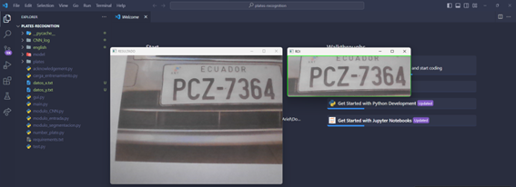
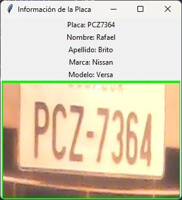

# plates-recognition

Este repositorio contiene un sistema simple de reconocimiento de placas utilizando Python y diversas bibliotecas. A continuación, se describe la funcionalidad de cada archivo en el proyecto:

## Archivos en el Repositorio

### 1. `number_plate.py`

Este script utiliza OpenCV para detectar placas de matrícula en tiempo real a través de la cámara. Las placas detectadas se muestran en la pantalla, y puedes guardar la imagen de la placa presionando la tecla 's'.

### 2. `acknowledgement.py`

Este script utiliza la biblioteca EasyOCR para reconocer texto en una imagen. El texto reconocido se imprime en la consola.

### 3. `gui.py`

Una interfaz gráfica simple construida con Tkinter que muestra información sobre la placa reconocida. Se conecta a una base de datos MySQL (asegúrate de configurar las credenciales) para obtener información adicional sobre la placa.

### 4. `main.py`

Este script ejecuta secuencialmente los scripts `number_plate.py` y `gui.py` utilizando el módulo subprocess.

## Uso del Repositorio
Asegúrate de tener todas las dependencias instaladas (opencv-python, easyocr, Pillow, mysql-connector-python).
Ejecuta el script `main.py` para iniciar el sistema de reconocimiento de placas.

## Capturas de Ejecución

